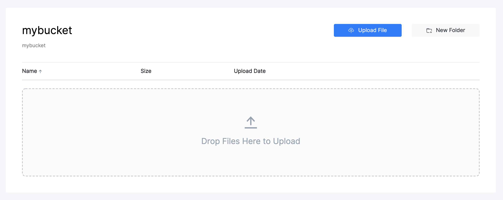

# storj/browser

> A Vue component for managing files on Storj, via [gateway-mt](https://github.com/storj/gateway-mt).



## Development

Use [Iris](https://github.com/storjrd/iris).

## Integration

### Install

Right now, `storj/browser` is not published to npm, so you have to install it from the git repo. This can be done by referencing a specific commit and adding it to your `package.json`.

```json
"dependencies": {
    ...
    "browser": "git+https://github.com/storj/browser#e2f7fd2b7a8502c41ca13b5fa0987df659e58efa",
},
```

```bash
npm install
```

### Add Vuex module

In order to use the file browser, we need to add the `files` module to our app store.

-   Import the files module in `src/store/index.js`

```javascript
import { files } from "browser";
```

-   Add it to the modules

```javascript
export default new Vuex.Store({
  state: {
      ...
  },
  mutations: {
      ...
  },
  actions: {
      ...
  },
  modules: {
    files
  }
})
```

### Create page to instantiate `FileBrowser`

-   In `src/views/MyFileBrowserPage.vue`, import the css

```html
<style scoped>
	@import "../node_modules/browser/dist/browser.css";
</style>
```

-   Instantiate the `FileBrowser` component inside a `<div>` with class `file-browser`.

```html
<template>
	<div class="home">
		<div class="file-browser">
			<file-browser></file-browser>
		</div>
	</div>
</template>
```

-   Initialize the store with `gateway-mt` credentials and an already-existing bucket

```html
<script>
	import { FileBrowser } from "browser";

	export default {
		name: "FileBrowserPage",
		data: () => ({
			displayCredentials: true,
			endpoint: "gateway.tardigradeshare.io",
			accessKey: "",
			secretKey: "",
			bucket: "",
			browserRoot: "/"
		}),
		created() {
			this.$store.commit("files/init", {
				endpoint: this.endpoint,
				accessKey: this.accessKey,
				secretKey: this.secretKey,
				bucket: this.bucket,
				browserRoot: this.browserRoot
			});
		}
	};
</script>
```

### Add `MyFileBrowserPage.vue` to your router

-   In `src/router/index.js`, add `MyFileBrowserPage` with a wildcard for all sub-paths.

```javascript
import MyFileBrowserPage from "../views/MyFileBrowserPage.vue";

const routes = [
	{
		path: "/",
		name: "Home",
		component: MyFileBrowserPage,
		children: [
			{
				path: "*",
				component: MyFileBrowserPage
			}
		]
	}
];
```
